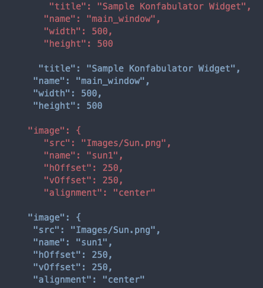

JSON Code Style
=========

## Command line interface
Install jsoncs with npm to use the command line interface:

    npm install @codelicia/jsoncs --save-dev

Verify if the code style is fine:

    ./node_modules/.bin/jsoncs my/file.json

### Options 

    $ jsoncs -h

    Usage: jsoncs [file]

    Options:
       -v, --version            print version and exit

### Example

* _RED_: wrong json
* _BLUE_: correct json

## TO-DO

* Fix the errors found by the JSONCS
* Make it multiple files
* Leave the code style to the user
